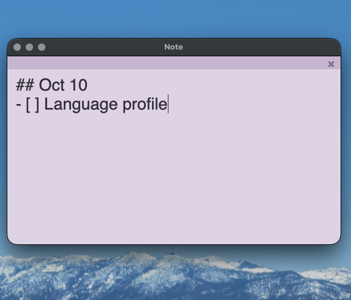

# Lilac Note (FU macOS Widget)

> A minimal desktop sticky note for macOS. One Python file, zero dependencies.

## Why this exists

Because macOS Widgets are broken.

This isn't just an angry rant — there are specific crimes here. I genuinely wanted to use the built-in Widgets. They live right on the desktop, no app to open, just jot something down. Sounds perfect. Then I spent an afternoon with them and wanted to throw my laptop out the window. Here's what actually happened. This is not made up.

### Crime 1: The Edit Widget panel gets stuck at the bottom of the screen

Right-click the desktop → Edit Widget. The edit panel pops up. But it doesn't appear in the middle of the screen like a normal window — it gets stuck at the very bottom, half-hidden behind the Dock. I try to drag it up. Nothing. The mouse presses on it and it just sits there, like a piece of tape stuck to the screen. I close it and reopen. Same position. Open it a different way. Same position. The panel is nailed to that coordinate.

### Crime 2: The Calendar Widget is a read-only brick

I naively thought: drop a Calendar Widget on the desktop, add an event, delete an event, right there. Nope. You click it, all it does is "open the Calendar app." You can't change a single thing on the Widget itself. Then what is it even for? I could just click the Calendar app in the Dock. What is the point of something that takes up a big chunk of my desktop and can't even do the most basic add-or-delete?

### Crime 3: The Reminder Widget spins forever

Fine, Calendar is useless. I'll use Reminders. Drop the Reminder Widget onto the desktop — it shows a loading animation. Wait. Keep waiting. Wait forever. It spins until the end of time.

Here's the weird part: **I click the Widget, it opens the Reminders app, and everything is right there.** Every item, all synced, working perfectly. The data is right there. But the Widget itself just won't refresh, stuck in loading forever. It's like a jerk who knows the answer and deliberately won't tell you.

### Then I went looking for fixes. I tried:

- `killall NotificationCenter` — nothing
- `killall chronod` — nothing
- Deleting caches in `~/Library/Containers/widget-com.apple.notificationcenterui` — nothing
- Creating a fresh admin user to test — nothing
- Booting into safe mode — nothing
- Checking if Focus modes were pausing widget updates — nothing
- Removing and re-adding widgets one by one — nothing

Not a single one of those worked. Not. A. Single. One.

**This isn't my problem. It's Apple's problem.** A multi-trillion-dollar company can't get "show a sticky note on the desktop" or "let a panel be draggable" right on its own operating system. What has Apple been doing? Fancy animations. Thicker and thicker glassmorphism. Redesigns nobody asked for. And basic stability thrown in the trash. If the built-in Widgets can be this broken, they expect us to praise them?

**So I wrote my own.** It's called Lilac Note. Four files: one script written with the Python standard library, one shell function, one `pyproject.toml`, one plain text file for your notes. It doesn't phone home. It doesn't collect data. It doesn't ask for permissions. It doesn't spin. It doesn't get stuck. It doesn't play hide-and-seek with you.

It does exactly one thing: **sits quietly on the desktop and lets you write.**

That's it. FU macOS Widget.

---

## Features

- **Minimal**: a single file, zero third-party dependencies, Python stdlib only
- **Not always-on-top**: other windows can cover it; won't interfere with full-screen work
- **Auto-save**: writes to `data/note.md` 0.5s after you stop typing
- **Markdown checkboxes**: type `- [ ] task`, double-click the line to toggle
- **Plain text storage**: your data is just a `.md` file, openable in Obsidian / VS Code / anything
- **Morandi lilac palette**: soft, muted, easy on the eyes

## Requirements

- macOS
- Python 3.14 (managed with [uv](https://github.com/astral-sh/uv) recommended)
- tkinter (Homebrew Python usually ships with it; if not, `brew install python-tk`)

## Install

git clone https://github.com/lily-lilac/lilac-note.git ~/dev/lilac-note
cd ~/dev/lilac-note
uv syncUsage
Source the shell function file first:

echo 'source ~/dev/lilac-note/note.sh' >> ~/.zshrc
source ~/.zshrc
Then:

note          # start
note stop     # stop
note restart  # restart
Controls
Action	How
Move the note	Drag the light purple bar at the top
Close	Click the × in the top-right (auto-saves)
Manual save	Cmd + S
Toggle a checkbox	Double-click a - [ ] task line
Writing Markdown checkboxes
Start a line with - [ ] followed by a space, then your text:

- [ ] Buy milk
- [ ] Reply to email
- [ ] Pay rent
Double-click anywhere on that line to toggle it to - [x]. Double-click again to toggle back.

Configuration
Everything tunable is at the top of scripts/desktop_note.py:

python
FONT_SIZE = 20
BG_COLOR   = "#E4D8E8"   # note background
BAR_COLOR  = "#D0BCD8"   # top drag bar
FG_COLOR   = "#3A3340"   # text color
Window position and size are in __init__:

python
self.root.geometry("400x320+80+120")
Project structure

lilac-note/
├── pyproject.toml
├── scripts/
│   └── desktop_note.py    # main program
├── data/
│   └── note.md            # note content (git-ignored)
├── note.sh                # shell function
└── README.md
Known issues
overrideredirect(True) on some macOS versions prevents the window from receiving keyboard input. If that happens, delete that line in scripts/desktop_note.py. It'll fall back to a normal window with a native title bar, and everything else still works.

License
MIT

Lilac Note（FU macOS Widget）
一个极简的 macOS 桌面便签。一个 Python 文件，零依赖。

为什么会有这个东西
因为 macOS 的 Widget 烂透了。

这不是一句情绪化的抱怨，是有具体罪状的。我本来是真心想用系统自带 Widget 的——它就在桌面上，不用打开任何 App，随手记点东西多好。结果我用了一个下午，被它折磨到想砸电脑。下面是真实发生的事，不是编的。

罪状一：Edit Widget 页面直接卡死在屏幕下方
右键点桌面 → Edit Widget，编辑面板弹出来了。但它不是正常地出现在窗口中间，而是卡在屏幕正下方，一半被 Dock 挡住。我想把它拖上来，拖不动。鼠标按上去毫无反应，就像拖一块贴死的膏药。我只能关掉它再重开，重开还是同一个位置。换个方式打开，还是同一个位置。这个面板仿佛被钉死在了那个坐标上。

罪状二：Calendar Widget 是个只读的摆设
我天真地以为，桌面上放个日历 Widget，就能直接在上面加一条日程、删一条日程。不行。你点它，它只能"打开日历 App"。你在 Widget 上什么都不能改。那我要你何用？我直接在 Dock 点日历 App 不就行了？一个占了桌面一大块地方、却连最基本的增删都做不了的东西，它的存在意义是什么？

罪状三：Reminder Widget 永远在转圈
好，日历不行，那我用提醒事项总行了吧。把 Reminder Widget 拖到桌面上——它显示一个加载动画。等。继续等。一直等。转圈转到地老天荒。

诡异的地方来了：你点开这个 Widget，它跳进提醒事项 App，里面内容显示得好好的，一条不少。数据明明就在那儿，同步也没问题。但那个 Widget 本身，就死活刷不出来，永远停在 loading 状态。它就像一个知道答案却故意不告诉你的混蛋。

然后我开始上网找解法。我试了：
killall NotificationCenter —— 没用

killall chronod —— 没用

删掉 ~/Library/Containers/widget-com.apple.notificationcenterui 里的缓存 —— 没用

新建一个管理员用户测试 —— 没用

进安全模式重启 —— 没用

检查专注模式有没有暂停小组件更新 —— 没用

一个个移除 Widget 再重新添加 —— 没用

以上方法一个都没用。一个都。没。有。

这不是我的问题，是苹果的问题。 一个市值几万亿美元的公司，在自己操作系统的桌面上，连"让一个便签显示出来"、"让一个面板能拖动"这种最基础的事情都做不好。苹果这几年在搞什么？搞花里胡哨的动画，搞越来越厚的玻璃拟态，搞各种用户根本没要求过的"重新设计"，然后把最基本的稳定性丢进垃圾桶。系统自带的小组件能烂成这样，还指望用户夸它？

所以我自己写了一个。 它叫 Lilac Note。它有四个文件：一个用 Python 标准库写的脚本，一个 shell function，一个 pyproject.toml，一个纯文本文件存你的便签。它不联网，不收集数据，不请求任何权限，不转圈，不卡死，不跟你玩躲猫猫。

它做的事情只有一件：安静地贴在桌面上，让你写字。

就这样。FU macOS Widget。

特性
极简：一个文件，零第三方依赖，只用 Python 标准库

不置顶：可以被其他窗口盖住，不会干扰全屏工作

自动保存：停手 0.5 秒后写入 data/note.md

Markdown 复选框：写 - [ ] 任务，双击整行切换勾选

纯文本存储：数据就是 .md 文件，随时可以用 Obsidian / VS Code 打开

莫兰迪丁香紫：默认配色是柔和的 Lilac，不刺眼

依赖
macOS

Python 3.14（推荐用 uv 管理）

tkinter（Homebrew 的 Python 一般自带；缺的话 brew install python-tk）

安装

git clone https://github.com/lily-lilac/lilac-note.git ~/dev/lilac-note
cd ~/dev/lilac-note
uv sync

使用
先 source shell function 文件：

echo 'source ~/dev/lilac-note/note.sh' >> ~/.zshrc
source ~/.zshrc
然后：

note          # 启动
note stop     # 关闭
note restart  # 重启
操作
动作	方式
移动便签	按住顶部浅紫细条拖动
关闭	点击右上角 ×（会自动保存）
手动保存	Cmd + S
切换复选框	双击 - [ ] 任务 那一行
Markdown 复选框怎么写
在行首写 - [ ] 后面跟一个空格，再写内容：

- [ ] 买牛奶
- [ ] 回邮件
- [ ] 交房租
双击这一行任意位置，就切换成 - [x]，再双击切回来。

配置
所有可调项都在 scripts/desktop_note.py 顶部：

python
FONT_SIZE = 20
BG_COLOR   = "#E4D8E8"   # 便签底色
BAR_COLOR  = "#D0BCD8"   # 顶部拖动条
FG_COLOR   = "#3A3340"   # 文字颜色
窗口初始位置和大小在 __init__ 里：

python
self.root.geometry("400x320+80+120")
项目结构

lilac-note/
├── pyproject.toml
├── scripts/
│   └── desktop_note.py    # 主程序
├── data/
│   └── note.md            # 便签内容（git 忽略）
├── note.sh                # shell function
└── README.md
已知问题
overrideredirect(True) 在极少数 macOS 版本上会让窗口无法接收键盘输入。如果遇到，删掉 scripts/desktop_note.py 里那一行即可，会退化成带原生标题栏的普通窗口，其他功能都不受影响。

License
MIT
